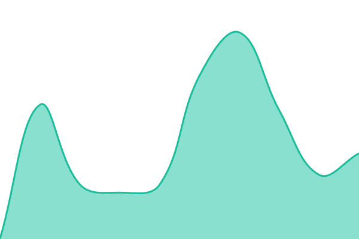

# [📈 Live Status](https://zefenergydev.github.io/ZEFUpptime): <!--live status--> **🟧 Partial outage**

This repository contains the open-source uptime monitor and status page for [ZEF Energy Inc.](https://www.zefenergy.com), powered by [Upptime](https://github.com/upptime/upptime).

With [Upptime](https://upptime.js.org), you can get your own unlimited and free uptime monitor and status page, powered entirely by a GitHub repository. We use [Issues](https://github.com/zefenergydev/ZEFUpptime/issues) as incident reports, [Actions](https://github.com/zefenergydev/ZEFUpptime/actions) as uptime monitors, and [Pages](https://zefenergydev.github.io/ZEFUpptime) for the status page.

<!--start: status pages-->
<!-- This summary is generated by Upptime (https://github.com/upptime/upptime) -->
<!-- Do not edit this manually, your changes will be overwritten -->
<!-- prettier-ignore -->
| URL | Status | History | Response Time | Uptime |
| --- | ------ | ------- | ------------- | ------ |
|  [ZEF Energy Public Website](https://www.zefenergy.com) | 🟩 Up | [zef-energy-public-website.yml](https://github.com/zefenergydev/ZEFUpptime/commits/HEAD/history/zef-energy-public-website.yml) | 

 433ms
     
 | 

<a href="https://zefenergydev.github.io/ZEFUpptime/history/zef-energy-public-website">100.00%</a>
    

|  [ZEFNET Partner API](api.zefenergy.com) | 🟥 Down | [zefnet-partner-api.yml](https://github.com/zefenergydev/ZEFUpptime/commits/HEAD/history/zefnet-partner-api.yml) | 

 399ms
     
 | 

<a href="https://zefenergydev.github.io/ZEFUpptime/history/zefnet-partner-api">6.80%</a>
    

|  [ZEFNET Portal](https://utility.zefenergy.com/shc) | 🟥 Down | [zefnet-portal.yml](https://github.com/zefenergydev/ZEFUpptime/commits/HEAD/history/zefnet-portal.yml) | 

 614ms
     
 | 

<a href="https://zefenergydev.github.io/ZEFUpptime/history/zefnet-portal">6.02%</a>
    

|  [ZEFNET Factory Portal](https://factory.zefenergy.com/home) | 🟩 Up | [zefnet-factory-portal.yml](https://github.com/zefenergydev/ZEFUpptime/commits/HEAD/history/zefnet-factory-portal.yml) | 

 694ms
     
 | 

<a href="https://zefenergydev.github.io/ZEFUpptime/history/zefnet-factory-portal">100.00%</a>
    

|  [ZEFNET Charge Mobile App](https://mobile.zefenergy.com) | 🟥 Down | [zefnet-charge-mobile-app.yml](https://github.com/zefenergydev/ZEFUpptime/commits/HEAD/history/zefnet-charge-mobile-app.yml) | 

 0ms
     
 | 

<a href="https://zefenergydev.github.io/ZEFUpptime/history/zefnet-charge-mobile-app">12.28%</a>
    

<!--end: status pages-->

[**Visit our status website →**](https://zefenergydev.github.io/ZEFUpptime)

## 📄 License

- Powered by: [Upptime](https://github.com/upptime/upptime)
- Code: [MIT](./LICENSE) © [Anand Chowdhary](https://anandchowdhary.com), supported by [Pabio](https://pabio.com)
- Data in the `./history` directory: [Open Database License](https://opendatacommons.org/licenses/odbl/1-0/)
